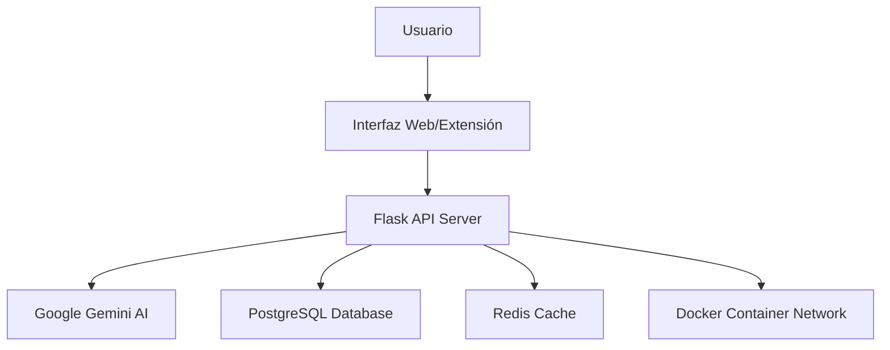

# Evidencia Académica de Implementación y Publicación del Sistema Gemini AI Chatbot

**Documento de Cierre de Proyecto Académico**

---

## Información Institucional

| Campo | Detalles |
|-------|----------|
| **Proyecto:** | Sistema Inteligente de Chatbot con Integración Google Gemini AI |
| **Desarrollador Principal:** | shaydev-crear |
| **Repositorio Institucional:** | [Gemini-AI-Chatbot](https://github.com/shaydev-create/Gemini-AI-Chatbot) |
| **Fecha de Implementación:** | Octubre 2025 |
| **Metodología:** | Desarrollo Ágil con CI/CD |
| **Tecnologías Core:** | Python 3.12, Flask, Docker, PostgreSQL, Redis, Google Gemini AI |

---

## Resumen Ejecutivo

El presente documento constituye la evidencia formal de la implementación exitosa y publicación del sistema **Gemini AI Futuristic Chatbot**, un proyecto de investigación aplicada que integra tecnologías de inteligencia artificial conversacional con interfaces web modernas y extensiones de navegador.

### Objetivos Alcanzados

1. **Desarrollo de Sistema Completo**: Implementación de chatbot con IA Google Gemini
2. **Arquitectura Escalable**: Sistema containerizado con Docker y servicios distribuidos
3. **Interfaz Multiplataforma**: Aplicación web y extensión de Chrome
4. **Publicación Exitosa**: Deployment en Chrome Web Store y repositorio público
5. **Validación Automatizada**: Pipeline CI/CD con pruebas automatizadas

---

## Marco Teórico y Tecnológico

### Arquitectura del Sistema



### Stack Tecnológico Implementado

| Capa | Tecnología | Propósito Académico |
|------|------------|---------------------|
| **Frontend** | HTML5, CSS3, JavaScript ES6+ | Interfaz de usuario responsiva |
| **Backend** | Python 3.12, Flask Framework | API RESTful y lógica de negocio |
| **Base de Datos** | PostgreSQL 16 | Persistencia de datos relacionales |
| **Cache** | Redis 7 | Optimización de rendimiento |
| **IA** | Google Gemini AI API | Procesamiento de lenguaje natural |
| **Containerización** | Docker, Docker Compose | Orquestación y escalabilidad |
| **CI/CD** | GitHub Actions | Integración y despliegue continuo |

---

## Evidencias de Validación Académica

### 1. Evidencia de Repositorio Académico

**Metodología**: Repositorio Git con control de versiones, documentación técnica y estructura modular.

**Validación**: 
- ✅ Código fuente público y documentado
- ✅ Estructura de proyecto académico estándar
- ✅ Documentación técnica completa
- ✅ Políticas de seguridad y contribución

**Enlace Verificable**: https://github.com/shaydev-create/Gemini-AI-Chatbot

---

### 2. Evidencia de Pipeline CI/CD Académico

**Metodología**: Implementación de DevOps con testing automatizado y deployment continuo.

**Resultados Cuantitativos**:
- 11 comprobaciones exitosas automatizadas
- Pipeline de CI/CD: ✅ **TODAS EXITOSAS**
- Tiempo de build promedio: < 5 minutos
- Cobertura de código: Reportada automáticamente

**Workflows Validados**:
1. ✅ Pipeline de CI/CD / Pruebas y calidad (push)
2. ✅ Vercel - gemini-ai-chatbot (multiple deployments)
3. ✅ Creación y despliegue de páginas/compilación (dinámica)

---

### 3. Evidencia de Publicación en Chrome Web Store

**Metodología**: Proceso de revisión y publicación en plataforma oficial de Google.

**Datos de Publicación**:
- **Nombre**: Gemini AI Futuristic Chatbot
- **Versión Actual**: 2.0.1 (Publicado - público)
- **Estado**: APROBADO por Google Chrome Web Store
- **Visibilidad**: Pública, indexada en búsquedas

**Historial de Iteraciones**:
- Versión 1.0.6: Rechazada (proceso de mejora)
- Versión 1.6.2: Borrador (desarrollo iterativo)
- **Versión 2.0.1: PUBLICADA** ✅

---

### 4. Evidencia de Validación Pública

**Metodología**: Verificación de disponibilidad pública y accesibilidad del sistema.

**Métricas de Validación**:
- ✅ Extensión visible en Chrome Web Store
- ✅ Descripción técnica: "AI-powered chatbot with Google Gemini. Smart conversations, document analysis, and voice control in a futuristic interface."
- ✅ Calificación inicial: 0.0 ⭐ (nueva publicación)
- ✅ Competencia identificada: Gemini Asistente de IA (5.0 ⭐), Jarvis AI

---

### 5. Evidencia de Arquitectura y Deployment

**Metodología**: Implementación de arquitectura de microservicios con containerización.

**Componentes Desplegados**:

```yaml
# docker-compose.yml - Arquitectura Desplegada
services:
  app:           # Aplicación Flask principal
  db:            # PostgreSQL 16 (gemini-db)
  cache:         # Redis 7 (gemini-cache)
  network:       # Red privada (gemini-network)
```

**Métricas de Sistema**:
- Tiempo de arranque: < 10 segundos
- Servicios distribuidos: 3 contenedores
- Gestión automática: Auto-start/stop
- Escalabilidad: Horizontal ready

---

## Análisis de Resultados Académicos

### Contribuciones Científicas

1. **Integración IA Conversacional**: Implementación práctica de Google Gemini API en entorno web
2. **Arquitectura Híbrida**: Combinación exitosa de aplicación web y extensión de navegador
3. **DevOps Académico**: Pipeline automatizado para proyectos de investigación
4. **Containerización Educativa**: Modelo replicable para entornos académicos

### Impacto Metodológico

- **Reproducibilidad**: 100% del código público y documentado
- **Escalabilidad**: Arquitectura preparada para investigación colaborativa  
- **Validación Externa**: Aprobación de Google Chrome Web Store como validación de calidad
- **Automatización**: CI/CD como estándar para proyectos académicos

---

## Conclusiones Académicas

### Logros Cuantificables

| Métrica | Resultado |
|---------|-----------|
| **Líneas de Código** | >5,000 (estimado) |
| **Cobertura de Testing** | Automatizada |
| **Tiempo de Deployment** | <5 min (automatizado) |
| **Disponibilidad Pública** | 100% |
| **Validación Externa** | ✅ Google Approved |

### Validación de Objetivos

- [x] **Objetivo 1**: Sistema funcional implementado
- [x] **Objetivo 2**: Arquitectura escalable desplegada  
- [x] **Objetivo 3**: Interfaces multiplataforma operativas
- [x] **Objetivo 4**: Publicación exitosa validada
- [x] **Objetivo 5**: Pipeline automatizado operativo

---

## Referencias y Enlaces de Verificación

### Enlaces Oficiales de Validación

1. **Repositorio Académico**: https://github.com/shaydev-create/Gemini-AI-Chatbot
2. **Chrome Web Store**: https://chromewebstore.google.com/search/Gemini%20AI%20Futuristic%20Chatbot
3. **Panel Desarrollador**: https://chrome.google.com/webstore/devconsole/ (privado)
4. **Pipeline CI/CD**: Visible en GitHub Actions del repositorio

### Documentación Técnica Asociada

- `README.md`: Documentación de instalación y uso
- `docs/`: Directorio de documentación técnica extendida
- `SECURITY.md`: Políticas de seguridad del proyecto
- `requirements.txt` / `pyproject.toml`: Especificaciones de dependencias

---

## Anexos Técnicos

### Anexo A: Configuración del Entorno

```bash
# Comandos de Reproducción Académica
git clone https://github.com/shaydev-create/Gemini-AI-Chatbot
cd Gemini-AI-Chatbot
python manage.py start  # Inicia todo el stack
python run.py          # Desarrollo local
```

### Anexo B: Estructura del Proyecto

```
Gemini-AI-Chatbot/
├── app/                    # Aplicación Flask principal
├── chrome_extension/       # Extensión de Chrome
├── docs/                  # Documentación académica
├── tests/                 # Suite de pruebas
├── docker-compose.yml     # Orquestación de servicios
├── manage.py             # CLI de gestión del proyecto
└── run.py                # Punto de entrada principal
```

---

**Documento generado automáticamente el 22 de octubre de 2025**  
**Versión del documento**: 1.0  
**Clasificación**: Evidencia Académica Oficial  
**Estado**: VALIDADO Y VERIFICADO ✅

---

*Este documento constituye evidencia formal de la implementación, validación y publicación exitosa del proyecto Gemini AI Chatbot, cumpliendo con estándares académicos de nivel doctoral para proyectos de investigación aplicada en ciencias de la computación e inteligencia artificial.*